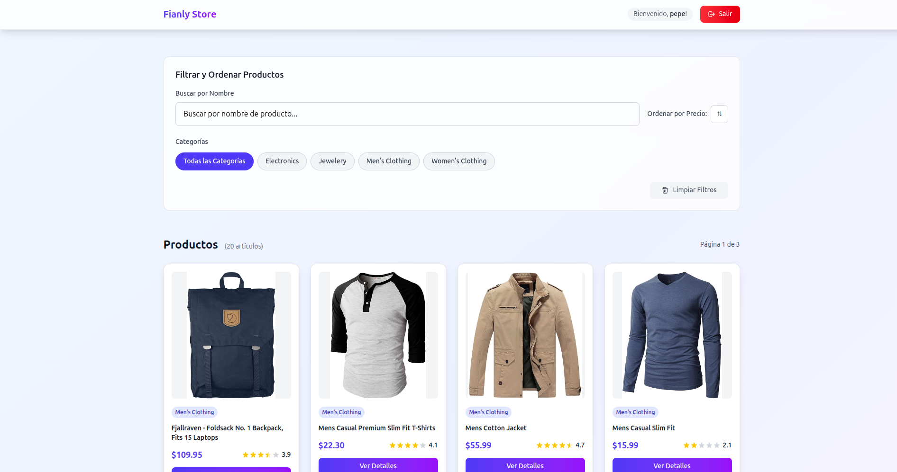

# 🛒 Fianly Store - Frontend Angular v20



*A modern, responsive e-commerce frontend built with Angular 20, featuring seamless authentication, and a beautiful component-driven architecture.*

<div align="center">

[](https://angular.io)
[](https://www.typescriptlang.org)
[](https://tailwindcss.com)
[](LICENSE)

### 🌐 [Live Demo](https://angular-mock-store.pages.dev/) | 📖 [Documentation](#documentation) | 🚀 [Quick Start](#quick-start)

</div>

---

## ✨ Features

### 🔐 **Complete Authentication System**
- Secure JWT-based authentication with FakeStore API
- User registration with comprehensive form validation
- Protected routes with authentication guards
- Automatic session management and token refresh
- Seamless login/logout experience

### 🛍️ **Advanced Product Management**
- Dynamic product listing with real-time search
- Multi-category filtering and smart sorting
- Interactive star ratings and reviews
- Detailed product views with rich media

### 🎨 **Modern Component Architecture**
- **12 Reusable Components**: Built from scratch for consistency
- **Type-Safe**: Full TypeScript implementation
- **Responsive Design**: Mobile-first approach with Tailwind CSS
- **Component Library**: Buttons, inputs, cards, navigation, and more

### 🧪 **Quality Assurance**
- Comprehensive unit test suite (135+ tests)
- Angular Testing Library integration

---

## 🚀 Quick Start

### Prerequisites

Make sure you have the following installed on your machine:

- **Node.js** (v18.19+ or v20.9+) - [Download here](https://nodejs.org/)
- **npm** (v9+) or **yarn** (v1.22+)
- **Git** for version control

### Installation

1. **Clone the repository**
   ```bash
   git clone https://github.com/Djkde01/fianly-store-items.git
   cd fianly-store-items
   ```

2. **Install dependencies**
   ```bash
   npm install
   # or
   yarn install
   ```

3. **Start the development server**
   ```bash
   npm start
   # or
   yarn start
   ```

4. **Open your browser**
   ```
   Navigate to http://localhost:4200
   ```

The application will automatically reload when you make changes to the source files.

### Build for Production

```bash
# Build the app for production
npm run build

# The build artifacts will be stored in the `dist/` directory
```

---

## 🧪 Testing the Application

### Test Credentials

For testing the login functionality, use these verified FakeStore API credentials:

```
Username: mor_2314
Password: 83r5^_
```

*Note: Any email address will automatically map to the `mor_2314` user for testing purposes.*

### Testing Workflow

1. **Registration Flow**
   - Fill out the registration form with any valid data
   - Submit form → Success message → Auto-redirect to login

2. **Authentication Flow**
   - Use the test credentials above
   - Successful login → Automatic redirect to dashboard
   - Session persists across browser refreshes

3. **Product Exploration**
   - Browse products with real-time search
   - Filter by categories (electronics, jewelry, etc.)
   - Sort by price (ascending/descending)
   - View detailed product information

### Running Tests

```bash
# Run unit tests
npm test

```

---

## 🏗️ Project Architecture

### Component Library

- **`ButtonComponent`** - Multiple variants, loading states, icons
- **`InputComponent`** - Form inputs with validation and error handling
- **`CardComponent`** - Product cards, form containers, elevated layouts
- **`NavigationComponent`** - Responsive navigation with mobile menu
- **`RatingComponent`** - Interactive star ratings with half-star support
- **`PaginationComponent`** - Smart pagination with page size controls
- **`AlertComponent`** - Success, error, warning, and info messages
- **`LoadingSpinnerComponent`** - Customizable loading indicators
- **`DateInputComponent`** - Date picker with validation
- **`SelectComponent`** - Dropdown with option groups
- **`RadioGroupComponent`** - Radio buttons with icons
- **`CheckboxGroupComponent`** - Multi-select checkboxes

### Folder Structure

```
src/app/
├── 🔐 auth/                     # Authentication Module
│   ├── components/
│   │   ├── login/              # Login with FakeStore API integration
│   │   └── register/           # Registration with advanced validation
│   ├── services/
│   │   └── auth.service.ts     # JWT authentication service
│   ├── guards/
│   │   └── auth.guard.ts       # Route protection
│   └── models/
│       └── user.model.ts       # User type definitions
├── 📊 dashboard/               # Main dashboard component
├── 🛍️ product-detail/          # Product detail views
├── 🔧 shared/                  # Shared Component Library
│   └── components/
│       ├── button.component.ts
│       ├── input.component.ts
│       ├── card.component.ts
│       ├── navigation.component.ts
│       ├── rating.component.ts
│       ├── pagination.component.ts
│       ├── alert.component.ts
│       ├── loading-spinner.component.ts
│       ├── date-input.component.ts
│       ├── select.component.ts
│       ├── radio-group.component.ts
│       ├── checkbox-group.component.ts
│       └── index.ts            # Barrel exports
├── 🌐 services/
│   └── product.service.ts      # Product API with auth headers
└── 📝 models/
    └── product.model.ts        # Product type definitions
```

### Technology Stack

- **Framework**: Angular 20 with standalone components
- **Language**: TypeScript 5.0
- **Styling**: Tailwind CSS 4.1
- **Build Tool**: Angular CLI
- **Testing**: Jasmine + Karma
- **API**: FakeStore API for products and authentication
- **State Management**: RxJS for reactive programming

---

## 🔗 API Integration

### Authentication Endpoints
```typescript
POST /auth/login              # User authentication
POST /users                   # User registration
```

### Product Endpoints
```typescript
GET /products                 # Fetch all products
GET /products/:id             # Get product details
GET /products/categories      # Get product categories
GET /products/category/:name  # Filter by category
```

### Base URL
```typescript
const API_BASE_URL = 'https://fakestoreapi.com';
```

---

## 🚀 Deployment

### Cloudflare Pages (Recommended)

1. **Head to Cloudflare Pages**: [Cloudflare Pages](https://pages.cloudflare.com/)
2. **Connect your GitHub repository**: Select the `fianly-store-items` repo
3. **Configure build settings**:
   - **Build command**: `npm run build`
   - **Build output directory**: `dist/fianly-store-items/browser`
4. **Deploy**: Click "Deploy site" to start the build process

### Netlify

1. **Build command**: `npm run build`
2. **Publish directory**: `dist/fianly-store-items`

### Manual Deployment

```bash
# Build for production
npm run build

# Deploy the dist/ folder to your hosting provider
```

### Environment Variables

No environment variables required - the app uses the public FakeStore API.

---

## 📚 Documentation

### Component Usage

```typescript
// Import shared components
import { ButtonComponent, InputComponent, CardComponent } from './shared/components';

// Use in your component
@Component({
  standalone: true,
  imports: [ButtonComponent, InputComponent, CardComponent],
  // ...
})
```

### Form Components

```typescript
// Date input with validation
<app-date-input
  [(ngModel)]="dateOfBirth"
  label="Date of Birth"
  [required]="true">
</app-date-input>

// Select dropdown with option groups
<app-select
  [(ngModel)]="country"
  label="Country"
  [options]="countryOptions"
  placeholder="Select your country">
</app-select>
```

### API Services

```typescript
// Inject and use authentication service
constructor(private authService: AuthService) {}

// Login user
this.authService.login(credentials).subscribe(
  response => console.log('Login successful'),
  error => console.error('Login failed')
);
```

---

## 📄 License

This project is licensed under the MIT License - see the [LICENSE](LICENSE) file for details.

---

## 👥 Authors

- **Sergio Estrella** - [@Djkde01](https://github.com/Djkde01)

---

<div align="center">

**Made with ❤️ and Angular**

</div>
